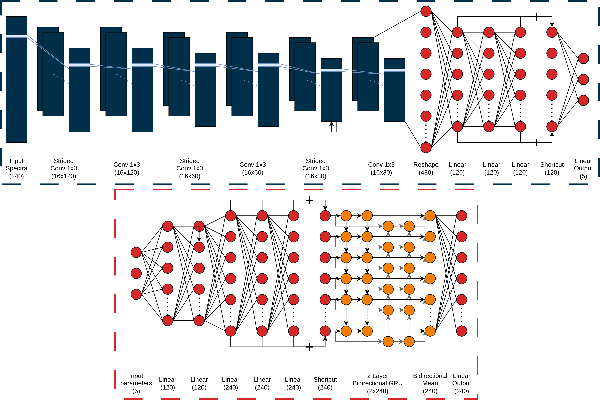

# Fast Spectra Predictor Network (FSP-Net)

## Contents

* [**1 Requirements**](https://github.com/EthanTreg/Spectrum-Machine-Learning/blob/master/README.md#1-requirements)  
* [**2 Information**](https://github.com/EthanTreg/Spectrum-Machine-Learning/blob/master/README.md#2-information)  
    * [**2.1 Description**](https://github.com/EthanTreg/Spectrum-Machine-Learning/blob/master/README.md#21-description)  
    * [**2.2 System Specification**](https://github.com/EthanTreg/Spectrum-Machine-Learning/blob/master/README.md#22-system-specification)
    * [**2.3 Training Times**](https://github.com/EthanTreg/Spectrum-Machine-Learning/blob/master/README.md#23-training-times)
    * [**2.4 Data Compatibility**](https://github.com/EthanTreg/Spectrum-Machine-Learning/blob/master/README.md#24-data-compatibility)
* [**3 How to Use**](https://github.com/EthanTreg/Spectrum-Machine-Learning/blob/master/README.md#3-how-to-use)
    * [**3.1 Using the Pre-Trained FSP-Net**](https://github.com/EthanTreg/Spectrum-Machine-Learning/blob/master/README.md#31-using-the-pre-trained-fsp-net)
      * [**3.1.1 Data Requirements**](https://github.com/EthanTreg/Spectrum-Machine-Learning/blob/master/README.md#311-data-requirements)
      * [**3.1.2 Data Preprocessing**](https://github.com/EthanTreg/Spectrum-Machine-Learning/blob/master/README.md#312-data-preprocessing)
      * [**3.1.3 Network Configuration**](https://github.com/EthanTreg/Spectrum-Machine-Learning/blob/master/README.md#313-network-configuration)
      * [**3.1.4 Fitting the Data**](https://github.com/EthanTreg/Spectrum-Machine-Learning/blob/master/README.md#314-fitting-the-data)
    * [**3.2 Training the Autoencoder**](https://github.com/EthanTreg/Spectrum-Machine-Learning/blob/master/README.md#32-training-the-autoencoder)
      * [**3.2.1 Generating Synthetic Data**](https://github.com/EthanTreg/Spectrum-Machine-Learning/blob/master/README.md#321-generating-synthetic-data)
      * [**3.2.2 Training the Autoencoder**](https://github.com/EthanTreg/Spectrum-Machine-Learning/blob/master/README.md#322-training-the-autoencoder)
    * [**3.3 Running Scripts via Command Line**](https://github.com/EthanTreg/Spectrum-Machine-Learning/blob/master/README.md#33-running-scripts-via-command-line)
* [**4 Analysis Tools**](https://github.com/EthanTreg/Spectrum-Machine-Learning/blob/master/README.md#4-analysis-tools)
    * [**4.1 Plotting Reconstructions and Loss per Epoch**](https://github.com/EthanTreg/Spectrum-Machine-Learning/blob/master/README.md#41-plotting-reconstructions-and-loss-per-epoch)
    * [**4.2 Comparing Parameter Predictions Against Fitted Parameters**](https://github.com/EthanTreg/Spectrum-Machine-Learning/blob/master/README.md#42-comparing-parameter-predictions-against-fitted-parameters)
    * [**4.3 Calculating & Plotting the Saliency**](https://github.com/EthanTreg/Spectrum-Machine-Learning/blob/master/README.md#43-calculating-&-plotting-the-saliency)
    * [**4.4 Getting the PGStatistics of the Encoder**](https://github.com/EthanTreg/Spectrum-Machine-Learning/blob/master/README.md#44-getting-the-pgstatistics-of-the-encoder)
* [**5 Modifying the Network**](https://github.com/EthanTreg/Spectrum-Machine-Learning/blob/master/README.md#5-modifying-the-network)
    * [**5.1 Manually Configuring the Network**](https://github.com/EthanTreg/Spectrum-Machine-Learning/blob/master/README.md#51-manually-configuring-the-network)
    * [**5.2 Optimising Hyperparameters using Optuna**](https://github.com/EthanTreg/Spectrum-Machine-Learning/blob/master/README.md#52-optimising-hyperparameters-using-optuna)

## 1 Requirements

* Install dependencies:  
`pip install -r requirements.txt`  
* PyTorch's dependencies[^1]:  
  NVIDIA GPU with [CUDA Toolkit](https://developer.nvidia.com/cuda-toolkit-archive) ~= v11.6
  [^1]: Only required for use with NVIDIA GPU
* PyXspec dependency[^2]:  
  Xspec from [HEASoft](https://heasarc.gsfc.nasa.gov/lheasoft/install.html) provided by NASA
  [^2]: Only required if using `synthesize_spectra.py` or `spectrum_fit.py`&rarr;`pyxspec_test`

## 2 Information

### 2.1 Description

FSP-Net is an autoencoder with two halves, an encoder and a decoder.  
The encoder is used to predict spectral parameters from spectra,
while the decoder reconstructs spectra from spectral parameters.

### 2.2 System Specification

The system specs used to develop the network are:
* Operating system: Ubuntu
* CPU: Intel 6C/12T, 2.6 GHz - 5 GHz (i7-10750H)
* GPU: NVIDIA 4 GB VRAM, 1035 - 1200 MHz (1650 Ti Max-Q)

NVIDIA GPUs with more than 1 GB of VRAM[^2] are highly recommended.  
All CPUs that can run PyTorch should work fine, but will be significantly slower.  
The code has not been developed for other brands of GPUs or NPUs,
so it won't take advantage of them.  
SSDs are also highly recommended as this can speed up data loading times.
[^2]: If your NVIDIA GPU has less than 1 GB of VRAM,
set `kwargs={}` in `spectrum_fit.py`&rarr;`initialization`

### 2.3 Training Times
Training the decoder for 200 epochs with 100,000 spectra
takes around 15 minutes on the GPU and 70 minutes on the CPU.  
Training the encoder for 200 epochs with 10,800 spectra
takes around 3 minutes on the GPU and 23 minutes on the CPU.

### 2.4 Data Compatibility
The network is designed for data from black hole X-ray binaries from the
Neutron star Interior Composition Explorer (**NICER**) instrument.  
It has **not been tested** on data collected by **other instruments** or for **different sources**,
so retraining will likely be required.  
However, the idea is that this network can be applied to several applications,
so feel free to adapt it and train it to different use cases.



## 3 How to Use

There is a configuration file, `config.yaml` that has several variables that can be changed.
There are 5 sections within `config.yaml`:
* `global-variables` - Variables shared across different scripts
* `spectrum-fit` - Main autoencoder script for `spectrum_fit.py`
* `data-preprocessing` - Data preprocessing script for `data_preprocessing.py`
* `synthesize-spectra` - Synthesising synthetic spectra script for `synthesize_spectra.py`
* `network-optimizer` - Network optimisation script for `network_optimizer.py`

These sections will be referenced throughout this `README`.  
Some parameters found in each section may be set under `global-variables`.

All file paths can be absolute or relative.

### 3.1 Using the Pre-Trained FSP-Net

The network has been trained on a simple 5-parameter model from Xspec, tbabs(simplcutx(ezdiskbb)).  
Therefore, weights are provided if this is the desired model for parameter prediction.

#### 3.1.1 Data Requirements

To generate parameters on a dataset, first make sure that data has been **properly preprocessed**.  
* The network is designed for an input spectrum of **size 240**.  
* All spectra **must be saved** in a `.pickle` file
  as a numpy array of **dimensions** $n \times 240$ in a dictionary with the key `spectra`
* The network is designed for the data to be **pre-normalised**;
  however, the network may still perform well or require retraining, pre-processing follows:
  1. Divide spectrum and background by their respective exposure time
  2. Subtract background from the spectrum
  3. Bin the spectrum and divide by the energy of each bin
  4. Divide by the number of detectors
  5. Remove energies outside the range of 0.3 - 10 keV

If these requirements are not met,
modules from `data_preprocessing.py` can be used to perform all the necessary preprocessing.

#### 3.1.2 Data Preprocessing

If your data doesn't meet the requirements above,
`data_preprocessing.py` can produce the necessary data type.

1. Set data paths in `data-preprocessing`:
   * `spectra-directory`: _spectra fits files path_
   * `background-directory`: _background fits files path
     \+ background path in spectra fits file_
   * `processed-path`: _processed output file path_
   * Other settings are optional to change
2. Run `python3 -m fspnet.data_preprocessing` from the root directory
   or import using `from fspnet.data_preprocessing import preprocess`  
   The config file path can be added as an optional argument, default is `../config.yaml`

#### 3.1.3 Network Configuration

To configure the network, first check the settings under `spectrum-fit`:
* `training` options:
  * `encoder-load`: 1
  * `encoder-name`: 'Encoder V3'
  * `network-configs-directory`: `'../network_configs/'`,
    make sure this directory exists/is correct and contains the file `Encoder V3.json`
* `data` options:
  * `encoder-data-path`: _path to your data file
    containing the spectra that you want parameters for_

All other options should be fine as defaults or aren't required.

#### 3.1.4 Fitting the Data

There are two methods to fit data:
* Run `spectrum_fit.py`: Provides several analysis results;
  however, this makes it slower and more configuration settings are required,
  this is **not recommended**, but is useful to see how functions can be used
* Import `from fspnet.spectrum_fit import predict_parameters`:
  Fast, integrates with code and is the **recommended approach**

Both approaches take the optional argument the configuration file path with the default of
`../config.yaml`.  
Both approaches also output the predicted parameters to
`spectrum-fit`&rarr;`output`&rarr;`parameter-predictions-path`.  
The output file contains the spectrum name or file number,
and the predicted values for the free parameters as a `.csv` file.

### 3.2 Training the Autoencoder

If your data does match the conditions that the network was trained for,
or you want to adapt the network, then the network can be retrained.

The autoencoder is trained in a semi-supervised manner to enforce the latent space to be physical.  
This is done by first training the decoder using supervised learning on synthetic data.  
Once the decoder is trained, it can be used to train the encoder using unsupervised learning
by training the network as an autoencoder.

#### 3.2.1 Generating Synthetic Data

Synthetic spectra is generated using Xspec with the model that you want to fit.  
This can be done independently; however, the data needs to meet the requirements as mentioned in
[Data Requirements](https://github.com/EthanTreg/Spectrum-Machine-Learning/blob/master/README.md#311-data-requirements).  
Alternatively, the script `synthesize_spectra.py` can be used to generate the spectra for you.

1. Configure settings in `synthesize-spectra`:
   * `synthesize` options:
     * `synthetic-number`: _recommended 100,000_, the more, the better, but the slower the training
   * `data` options:
     * `spectra-directory`: _real spectra fits files path_
     * `names-path`: _spectra names file path_, not required,
       leave empty if this doesn't exist
   * `model`:
     * `parameters-number`: _number of free parameters_
     * `model-name`: _Xspec name of the model_
     * `custom-model-name`: _Xspec name of custom model to be imported_
     * `model-directory`: _custom model directory path_
     * `log-parameters`: _list of indices of logged parameters_,
       index **starts from 0**
     * `parameter-limits`: _list of dictionaries of free parameter limits_,
       dictionary must contain the upper and lower limit to sample from
     * `fixed-parameters`: _dictionary of index and value for fixed parameters_,
       index **starts from 1**
   * `output`:
     * `synthetic-path`: _path to save synthetic spectra file_
2. Run `synthesize_spectra.npy`, can be provided with optional configuration file path argument,
   default is `../config.yaml`

`synthesize_spectra.py` will generate a `.pickle` file containing
the preprocessed spectral data, parameters and uncertainties for use in training.

#### 3.2.2 Training the Autoencoder

There are two methods to train the autoencoder:
* Run `spectrum_fit.py`: Provides several analysis results;
  however, this makes it slower and more configuration settings are required,
  this is **not recommended**
* Import `from fspnet.spectrum_fit import initialization;
  from fspnet.utils.training import training; from fspnet.utils.utils import open_config`:
  More control, can be implemented into existing code, and will be faster, this is **recommended**

The following steps assumes you are using the recommended method.

1. Configure settings in `spectrum-fit`:
    * `training` options:
      * `decoder-save`: 2
      * `encoder-save`: 2
      * `decoder-load`: 0
      * `encoder-load`: 0
      * `epochs`: _recommended 100_, more is better, but takes longer and has diminishing returns
      * `network-configs-directory`: `'../network_configs/'`,
      make sure this directory exists/is correct and contains the file `Encoder V3.json`
    * `data` options:
      * `decoder-data-path`: _synthetic spectra file path_
      * `encoder-data-path`: _spectra path_
    * `model` options:
      * `parameters-number`: _number of free parameters in the model_
      * `model-name`: _Xspec name of the model_, same as used for generating synthetic spectra
      * `custom-model-name`: _Xspec name of custom model to be imported_,
        same as used for generating synthetic spectra
      * `model-directory`: _custom model directory path_,
        same as used for generating synthetic spectra
      * `log-parameters`: _list of **free** parameter with indices **starting from 0**_,
        used for any parameter that spans a large range,
        doesn't have to be the same as used for generating synthetic spectra
      * `fixed-parameters`: _dictionary of index and value for fixed parameters_,
        index **starts from 1**
    * `output` options:
      * `network-states-directory`: _path to save network training progress_
2. Load `config.yaml` by calling `open_config` with the parameters _key_ and _config_path_,
   this will return the configuration path (not needed) and dictionary (`config`), 
3. Retrieve the following variables from `config`:
    * `epochs = config['training']['epochs']`
    * `d_save_num = config['training']['decoder-save']`
    * `e_save_num = config['training']['encoder-save']`
    * `states_dir = config['output']['network-states-directory']`
4. Initialise the data and decoder by calling
   `initialization` with the parameters _name_ and _config_,
   this will return the decoder (`decoder`) data loaders (`d_loaders`)
   and the decoder network as the second and third index, respectively.
5. Initialise the data and encoder as done in step 2, but with the additional argument
   `transform=d_loaders[0].dataset.dataset.transform`,
   and retrieving the fourth index for the device (`device`).
6. Train the decoder by calling `training` with the parameters:
    * `(0, epochs)`
    * `d_loaders`
    * `decoder`
    * `device`
    * `states_dir=state_dir`
7. Repeat the same for the encoder, but with the additional argument `surrogate=decoder`

**Example code**:

```python
from fspnet.spectrum_fit import initialization
from fspnet.utils.training import training
from fspnet.utils.utils import open_config

config_path = './config.yaml'

# Open configuration file
_, config = open_config('spectrum-fit', config_path)

# Load parameters
epochs = config['training']['epochs']
d_save_num = config['training']['decoder-save']
e_save_num = config['training']['encoder-save']
states_dir = config['output']['network-states-directory']

# Initialise networks
d_loaders, decoder = initialization('decoder', config)[2:4]
*_, e_loaders, encoder, device = initialization(
    'encoder',
    config_path,
    transform=d_loaders[0].dataset.dataset.transform
)

# Train networks
training(
    (0, epochs),
    d_loaders,
    decoder,
    device,
    save_num=d_save_num,
    states_dir=states_dir,
)
training(
    (0, epochs),
    e_loaders,
    encoder,
    device,
    save_num=e_save_num,
    states_dir=states_dir,
    surrogate=decoder,
)
```

Both networks should now be trained and their states should be saved to `network-states-directory`
with the file name `Decoder V2_2.pth` & `Encoder V3_2.pth`.

To generate the spectra parameter predictions, go to section
[Fitting the Data](https://github.com/EthanTreg/Spectrum-Machine-Learning/blob/master/README.md#314-fitting-the-data),
but replace `encoder-load` with 2.

### 3.3 Running Scripts via Command Line

Every script directly under fspnet can be run via the command line using the command:  
`python3 -m fspnet.[script name] [--option name] [option value]`  
All have the optional argument `--config_path`, which is the path to the configuration file,  
default is `../config.yaml`.

## 4 Analysis Tools

There are several functions included that can help with training the network and
measuring the performance.

### 4.1 Plotting Reconstructions and Loss per Epoch

The module `fspnet.utils.plots` contains the function `plot_training`,
which will plot the reconstructions and losses per epoch for a network.  
**Training the network is not required**
as the function `training` will still return the required outputs
when loading from a pre-trained network.

**Example code**:

```python
from fspnet.utils.training import training
from fspnet.utils.plots import plot_training

# Get predictions and spectra for the decoder
decoder_return = training(...)

plot_training('Decoder', config['output']['plots-directory'], *decoder_return)
```

### 4.2 Comparing Parameter Predictions Against Fitted Parameters

If you have previously fitted parameters,
you can compare the performance of the network for each parameter using the functions
`param_comparison`, `plot_param_comparison`, and `plot_param_distribution` from the modules
`fspnet.utils.analysis` and `fspnet.utils.plots`.

`param_comparison` and `plot_param_comparison` are used to plot parameter predictions against
fitted parameters for each parameter.

`plot_param_distribution` shows how the parameter predictions are distributed
compared to the fitted parameters.

To get the predictions, the function `predict_parameters` from `fspnet.spectrum_fit`
can be used as mentioned in
[Fitting the Data](https://github.com/EthanTreg/Spectrum-Machine-Learning/blob/master/README.md#314-fitting-the-data).

In addition to this, several parameters in the `spectrum-fit` config file need configuring:
* `data` options:
    * `encoder-parameters-path`: _path to the fitted parameters_
* 'model' options:
    * `parameter-names`: _list of names for each parameter_

**Example code**

```python
from fspnet.spectrum_fit import initialization, predict_parameters
from fspnet.utils.analysis import param_comparison
from fspnet.utils.plots import plot_param_comparison, plot_param_distribution

plots_dir = config['output']['plots-directory']
param_names = config['model']['parameter-names']

e_loaders = initialization(...)[2]

predict_parameters(config=config)
comparison_output = param_comparison(config=config)

plot_param_comparison(
    plots_dir,
    param_names,
    *comparison_output,
)
plot_param_distribution(
    plots_dir,
    [config['data']['encoder-data-path'], config['output']['parameter-predictions-path']],
    config,
)
```

### 4.3 Calculating & Plotting the Saliency

Saliency maps can be used to infer the influence of the input on the output.  
This can be useful to see what the network is trying to improve the most,
but it can be quite ambiguous.

There are two functions to calculate the saliency that come from `fspnet.utils.analysis`,
`decoder_saliency` and `autoencoder_saliency`.  
The autoencoder saliency can be plotted using `plot_saliency` from `fspnet.utils.plots`.

**Example code**:

```python
from fspnet.spectrum_fit import initialization
from fspnet.utils.plots import plot_saliency
from fspnet.utils.analysis import autoencoder_saliency, decoder_saliency

# Initialise networks
d_loaders, decoder = initialization(...)[2:4]
*_, e_loaders, encoder, device = initialization(...)

# Calculate saliencies
decoder_saliency(d_loaders[1], device, decoder)
saliency_output = autoencoder_saliency(e_loaders[1], device, encoder, decoder)
plot_saliency('../plots/', *saliency_output)
```

### 4.4 Getting the PGStatistics of the Encoder

To measure the performance of the encoder,
`pyxspec_test` from `fspnet.utils.training` can be used to generate
Poisson data, Gaussian noise statistics (PGStats) values for each prediction and return the median value.  
`pyxspec_test` uses PyXspec, which is slow, so it tries to leverage multiprocessing;
therefore, the more CPU cores, the faster this process will be.

The function will create a `.csv` file that will have
the spectrum name/number, predicted parameters and PGStat. 
The directory location is specified in
`spectrum-fit`&rarr;`output`&rarr;`worker-directory`  
The function will also return the median PGStat and predicted parameters.

**Example code**:

```python
from fspnet.spectrum_fit import initialization
from fspnet.utils.training import pyxspec_test

# Initialise networks
*_, e_loaders, encoder, device = initialization(...)

# Individual results will be saved to '../data/worker/Encoder_output.csv
median_pgstat, parameters = pyxspec_test(
    config['output']['worker-directory'],
    e_loaders[1],
    job_name='Encoder_output',
    device=device,
    encoder=encoder,
)
```

## 5 Modifying the Network

The code is designed to try and be as general as possible;
therefore, it should be very easy to change the architecture.  

### 5.1 Manually Configuring the Network

The architecture for the decoder and encoder are under the `network_configs` directory
and are saved as `.json` files.  

**File Construction**  
The file is structured as a dictionary containing two subdirectories:
* `net`: Parameters for the network, currently only has one option,
  `dropout_prob`, which is the dropout probability
* `layers`: List of dictionaries containing information on each layer,
  where the first layer takes the input and the last layer produces the output

**Layer Compatibilities**  
`reshape` layers are required for changing from linear layers to other layer types.  
Linear layers take inputs of dimension $N\times L$ (2D),
where $N$ is the batch size and $L$ is the length of the input.  
Other layer types take input of $N\times C\times L$ (3D), where $C$ is the number of channels.  
The input and output of the network are also 2D.

Going from 2D to 3D can be done by using `reshape` with `output = [1, -1]`.  
Going from 3D to 2D, `reshape` will use `output = [-1]`

**Layer Types**  
`layers` has several options, each with their own options:
* `linear`: Linear with SELU:
    * `factor`: optional float, _output size_ = `factor` $\times$ _network output size_,
      will be used if provided, else `features` will be used
    * `features`: optional integer, output size, won't be used if `factor` is provided
    * `dropout`: boolean, default = False, probability equals `dropout_prob`
    * `activation`: boolean, default = True, if a SELU activation should be used
* `convolutional`: Convolution with same padding using replicate,
  dropout and ELU:
    * `filters`: integer, number of convolutional filters
    * `dropout`: boolean, default = True, probability equals `dropout_prob`
    * `batch_norm`: boolean, default = False, batch normalisation
    * `activation`: boolean, default = True, if an ELU activation should be used
    * `kernel`: integer, default = 3, kernel size
    * `stride`: integer, default = 1, stride of the kernel
    * `padding`: integer or string, default = 'same',
      input padding, can an integer or _same_ where _same_ preserves the input shape
* `gru`: Gated recurrent unit (GRU) with ELU and dropout if parameter `layers` > 1:
    * `dropout`: boolean, default = True, probability equals `dropout_prob`
    * `activation`: boolean, default = True, if an ELU activation should be used
    * `layers`: integer, default = 2, number of GRU layers
    * `factor`: float, default = 1, 
      output size equals `factor` $\times$ _layer input size_
    * `bidirectional`: string, default = None,
      if a bidirectional GRU should be used and method for combining the two directions,
      can be _sum_, _mean_ or _concatenation_
* `linear_upscale`: Scales the layer input by two using a linear layer,
  **input and output is 3D**, uses SELU
* `conv_upscale`: Scales the layer input by two using convolution and pixel shuffle,
  so `filters` **must** be a multiple of two, uses kernel size of 3 and same padding
    * `filters`: integer, must be a multiple of two as $C_{out} = C_{in} / 2$
    * `batch_norm`: boolean, default = false, batch normalisation
    * `activation`: boolean, default = true, ELU activation
    * `kernel`: integer, default = 3, kernel size
* `conv_transpose`: Scales the layer input by two using transpose convolution,
  uses kernel size of 2 and stride 2, uses ELU and dropout
    * `filters`: integer, number of convolutional filters
    * `dropout`: boolean, default = True, probability equals `dropout_prob`
    * `batch_norm`: boolean, default = False, batch normalisation
    * `activation`: boolean, default = True, if an ELU activation should be used
* `upsample`: Linear interpolation scales layer input by two
* `conv_depth_downscale`: Reduces $C$ to one, uses kernel size of 1, same padding and ELU
    * `batch_norm`: boolean, default = False, batch normalisation
    * `activation`: boolean, default = True, if an ELU activation should be used
* `conv_downscale`: Downscales the layer input by two through strided convolution,
  uses kernel size of 2, padding of 1 using replicate and stride 2, uses ELU and dropout
    * `filters`: integer, number of convolutional filters
    * `dropout`: boolean, default = True, probability equals `dropout_prob`
    * `batch_norm`: boolean, default = False, batch normalisation
    * `activation`: boolean, default = True, if an ELU activation should be used
* `pool`: Downscales the layer input by two using max pooling
* `reshape`: Reshapes the dimensions
    * `output`: integer or tuple[integer, integer], dimensions of the output of the layer,
      ignoring the first dimension of $N$
* `extract`: Extracts values from the previous layer to pass to the output
    * `number`: integer, number of values to extract from the previous layer
* `concatenate`: Concatenates the previous layer with a specified layer
    * `layer`: integer, layer index to concatenate the previous layer with
* `shortcut`: Adds the previous layer with the specified layer
    * `layer`: integer, layer index to add to the previous layer

### 5.2 Optimising Hyperparameters using Optuna

Network optimisation using Optuna has been implemented in an early state;
however, it is currently not very modular;
therefore, it will likely require extra work to make it compatible
with different optimisation methods.  
The script for network optimisation is `fspnet.network_optimizer`.  
It can save the optimisation progress
and produce several plots to visualise the optimal hyperparameters.

Currently, only changing the learning rate, number of convolutional filters
and convolutional layers in two parts in the network are supported.

The function `optimize_network` can be imported to integrate network optimisation.  
`optimize_network` returns a dictionary containing the parameters from the best trial.

Several parameters in the `network-optimizer` config file need configuring:
* `optimization` options:
    * `name`: _name of the network to optimize_
* `output` options:
    * `network-states-directory`: _path to the directory containing the network states_

**Example code**

```python
from fspnet.network_optimizer import optimize_network
from fspnet.spectrum_fit import initialization

*_, loaders, _, device = initialization(...)

optimize_network(config, loaders, device)
```
